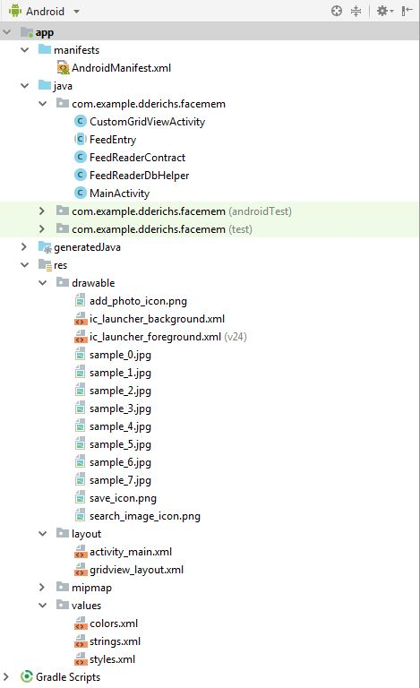
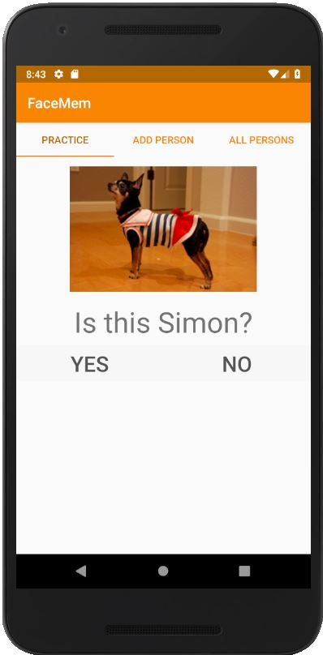
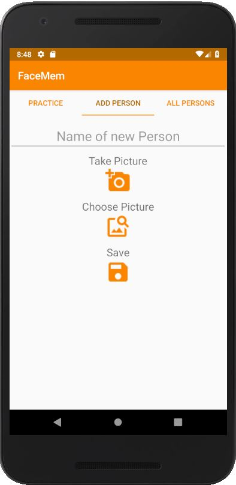
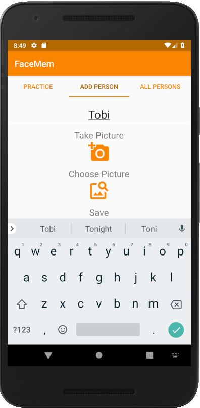
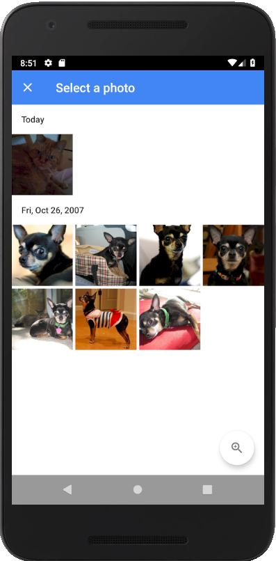
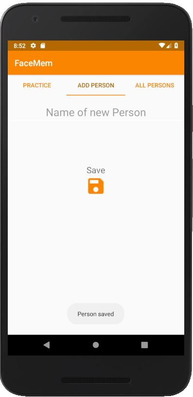
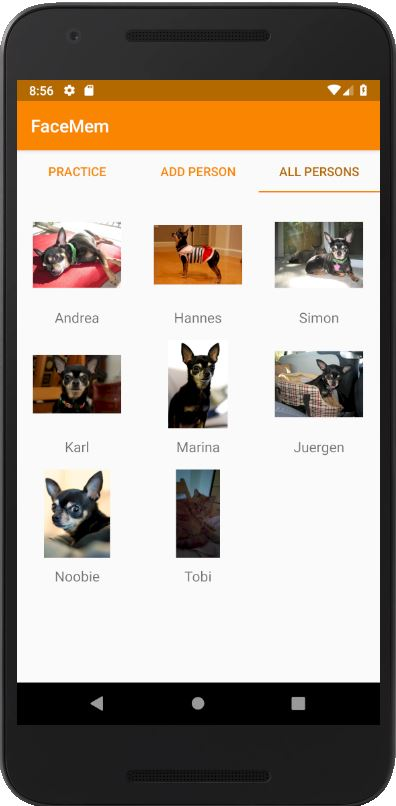
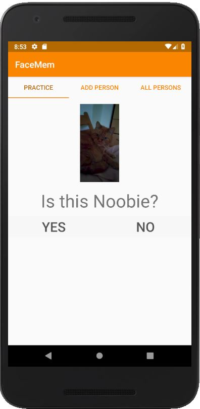

<h1>Einleitung</h1>

Die Anwendung kann Personen und deren Namen speichern. Ihre Aufgabe ist es, dem Nutzer zu helfen, diese Namen und Personen zu erlernen.

Ich bin auf die Idee in den Weihnachtsfeiertagen gekommen, weil ich in dieser Zeit viele neue Personen kennen gelernt, aber deren Namen schnell wieder vergessen habe. Diese App hätte mir beim schnellen Erlernen dieser Namen helfen können.

<h1>Anforderungen</h1>
<ul>
<li>Lernfunktion
	
Der Nutzer soll die möglichkeit haben, die Personennamen zu lernen. Dies soll durch die möglichst korrekte Zuordnung von Bildern und Namen erfolgen.

</li>
<li>Personen hinzufügen
	
Der Nutzer soll Personen hinzufügen können.

</li>
<li>Hinzufügen von Bildern/Fotos	

Zu den Personenn sollen Bilder gespeichert werden können.

</li>
<li>Liste aller Personen anzeigen (Lern-Hilfe)
	
Die Applikation soll eine Liste der bereits gespeicherten Personen anzeigen können.

	</li>
<li>Speicherung der Daten in einer Datenbank
	
Die gespeicherten Informationen sollen in einer kleinen Datenbank gespeichert werden können.

</li>
<li>Reduziertes Design
	
Das App Design soll auf das Wesentliche reduziert sein.

</li>
</ul>

<h1>Dokumentation</h1>
<h2>MainActivity -> oncreate()</h2>

 Ruft die folgenden Funktionen auf, um die App vorzubereiten

<h3>oncreate() -> cacheDatabaseEntries()</h3>

Nutzt einen FeedReaderContract, um Daten aus der Datenbank zu lesen und im Arbeitsspeicher die wichtigsten Informationen zur Laufzeit vorzuhalten. Dadurch sind Bilddateien schneller verfügbar.

<pre>    private void cacheDatabaseEntries(){
        mFeedReaderContract = new FeedReaderContract(this);
        try {
            Cursor cursor = mFeedReaderContract.ReadEntry();
            int i;
            if(cursor.getCount() &lt;= 0){
                gridViewString = new String[0];
                gridViewImagePath = new String[0];
                return;
            }    
            gridViewString = new String[cursor.getCount()];
            gridViewImagePath = new String[cursor.getCount()];    
            cursor.moveToFirst();
            for (i = 0; i &lt; cursor.getCount(); i++) {
                this.gridViewString[i] = 
                cursor.getString(cursor.getColumnIndex(&quot;Name&quot;));    
                this.gridViewImagePath[i] = 
                cursor.getString(cursor.getColumnIndex(&quot;Picturepath&quot;));
                cursor.moveToNext();
            }
        } catch (Exception e){
            Log.d(&quot;Facemem&quot;, e.getMessage());
        }
    }
</pre>

<h3>oncreate() -> initializeUIElements()</h3>

Legt die Inhalte und Darstellungsparameter aller Views fest

<pre>private void initializeUIElements(){
        linLayout_Practice = (LinearLayout) findViewById(R.id.linLayout_Practice);
        linLayout_Practice.setVisibility(View.VISIBLE);    
        linLayout_Practice_Dialog = (TextView) 
        findViewById(R.id.linLayout_Practice_Dialog);   
        practice_next = (Button) findViewById(R.id.practice_next);    
        practice_answer_true = (Button) 
        findViewById(R.id.practice_answer_true);    
        practice_answer_wrong= (Button) 
        findViewById(R.id.practice_answer_wrong);    
        button_Take_Picture = (ImageButton) 
        findViewById(R.id.button_Take_Picture);    
        button_Save_New_Person = (ImageButton) 
        findViewById(R.id.button_Save_New_Person);    
        button_Choose_Picture = (ImageButton) 
        findViewById(R.id.button_Choose_Picture);   
        imageView_Taken_Picture = (ImageView) 
        findViewById(R.id.imageView_Taken_Picture);    
        textEdit_New_Person_Name = (EditText) 
        findViewById(R.id.editText_New_Person_Name);    
        tabs = (TabLayout) findViewById(R.id.tabs);    
        hideNewPersonDialog();    
        }
        </pre>       

<h3>oncreate() -> setupUIListeners()</h3>

Meldet bei allen relevanten View Elementen Listener fest und definiert ihre Verhaltensweisen

<pre>    private void setupUIListeners(){
        setupListener_TabLayout();    
        setupListener_PracticeLayout();    
        setupListener_NewPersonLayout();
    }</pre>

<h3>oncreate() -> startPractise()</h3>

Läd die Lern-Funktion der App. Läd die View und die dazugehörigen Daten und geht in den Dialog mit dem User.
<pre style="font-size: 12px;">   private void startPractise(){
        resetPracticeView();
        this.practice_answer_true.setTextColor(getResources().getColor(R.color.inactive));
        this.practice_answer_wrong.setTextColor(getResources().getColor(R.color.inactive));   
        if(gridViewString.length &lt;= 0){
            this.linLayout_Practice_Dialog.setText(&quot;No Persons found. Try to add 
            Persons and come back later.&quot;);
            this.practice_answer_wrong.setVisibility(View.GONE);
            this.practice_answer_true.setVisibility(View.GONE);
        } else {
            this.randomIndexImage = new Random().nextInt(gridViewImagePath.length);
            this.randomIndexText = new Random().nextInt(gridViewString.length);    
            this.linLayout_Practice_Dialog.setText(&quot;Is this &quot; + 
            gridViewString[randomIndexText] + &quot;?&quot;);    
            ImageView practiceImage = (ImageView) 
            findViewById(R.id.linLayout_Practice_Image);            
            Bitmap bitmap = 
            BitmapFactory.decodeFile(gridViewImagePath[randomIndexImage]);
            practiceImage.setImageBitmap(bitmap);
        }
    }
</pre>

<h1>Gesamtstruktur</h1>

Die MainActivity beinhaltet insgesamt drei vollständige Views, die je nach Kontext ein- bzw. ausgeblendet werden. Sie sind nicht in XML ausgelagert worden, sondern werden zur Laufzeit auch dann aktualisiert, wenn sie nicht sichtbar sind. Dadurch ist die Applikation sehr viel performanter, aber die Datei-Struktur sieht etwas abgespeckter aus.

<h1>Anwendungsfall</h1>

Der Nutzer vergisst den Namen der Katze eines Freundes (Katze, da nicht datenschutzrechtlich relevant).

Der Nutzer startet die App und landet automatisch in der Lern-Funktion

Der Nutzer wählt in der Navigation "Add Person", um eine Neue Person hinzuzufügen

Der Nutzer gibt den Namen der Katze ein

Der Nutzer fügt entweder per Kamera App oder per FilePicker ein Bild hinzu.

Der Nutzer speichert die neuen Informationen

Der Nutzer schaut, ob der neue Eintrag in der Liste aller Personen zu sehen ist.

Die App berücksichtigt fortan den neuen Eintrag im Lern-Bereich

<h1>Zusammenfassung - Erreichte Ziele</h1>

Die App kann Personennamen und dazugehörige Bilder abspeichern. 

Sie kann alle Personen als Grid anzeigen. Die Darstellung der Bilder passt sich jeder Bildschirmgröße richtig an und ist scrollbar, sollte der Platz nicht voll ausreichen.

Sie bietet die Funktion, die Personen-Namen zu lernen.

Das Design ist einfach und reduziert.

<h1>Ausblick</h1>

Momentan ist die basiert Abfrage der Personendaten noch auf dem Zufall. In der Zukunft könnte man das Lernverhalten des Nutzers analysieren und mehr Fragen derjenigen Personen in das Lern-Feature einbauen, die er noch nicht so gut beherrscht.

Außerdem bietet die App derzeit keine Möglichkeit, die Daten nachträglich zu ändern. Diese Funktionalität wäre im Langzeitbetrieb unabdingbar, aber aus Zeitgründen nicht mehr innerhalb dieses Projektes umsetzbar.
